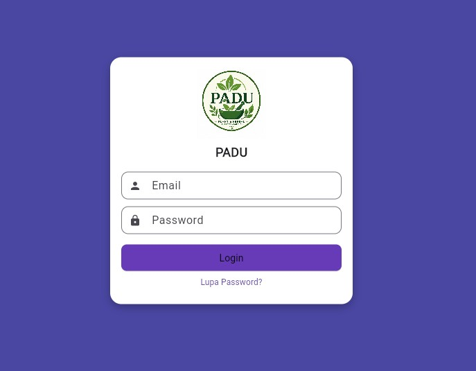
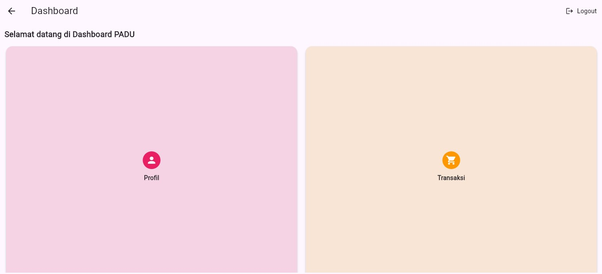
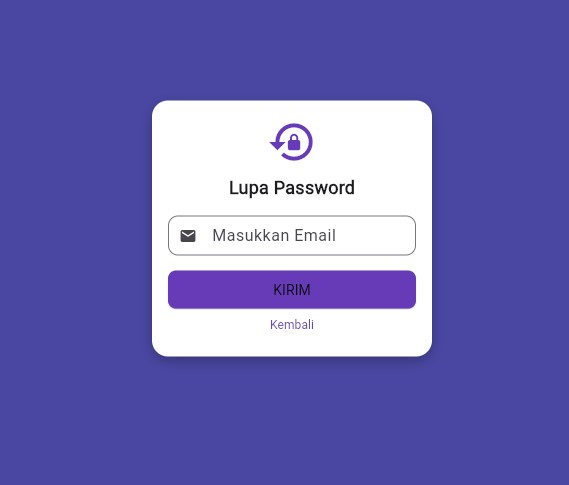

# padu

A new Flutter project.

## Getting Started

This project is a starting point for a Flutter application.

A few resources to get you started if this is your first Flutter project:

- [Learn Flutter](https://docs.flutter.dev/get-started/learn-flutter)
- [Write your first Flutter app](https://docs.flutter.dev/get-started/codelab)
- [Flutter learning resources](https://docs.flutter.dev/reference/learning-resources)

For help getting started with Flutter development, view the
[online documentation](https://docs.flutter.dev/), which offers tutorials,
samples, guidance on mobile development, and a full API reference.

# 🌿 PADU - Aplikasi Tanaman Herbal

## 📱 Deskripsi Aplikasi
PADU adalah aplikasi mobile berbasis Flutter yang menyediakan informasi tentang tanaman herbal yang bermanfaat untuk kesehatan tubuh. Aplikasi ini dibuat sebagai tugas UTS Mobile Programming.

---

## ✨ Fitur Aplikasi
- Login menggunakan email & password
- Dashboard tanaman herbal
- Halaman lupa password
- Navigasi antar halaman
- Tampilan UI sederhana dan responsif

---

## ▶️ Cara Menjalankan Aplikasi
    1. Clone repository ini
    2. Buka di VS Code / Android Studio
    3. Jalankan perintah:
        flutter pub get
    4. Jalankan aplikasi:
        flutter run

## 📸 Screenshot Aplikasi

### Login Page

### Dashboard Page

### Lupa Password Page
